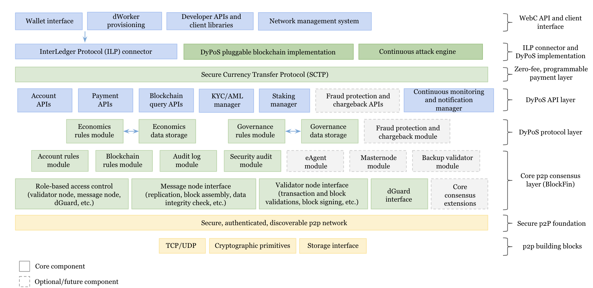

# BlockFin — Storecoin’s DyPoS Consensus Engine

## Storecoin				

Storecoin is a zero-fee public blockchain that brings scalable and decentralized zero-fee payment infrastructure to the public internet. Coordinated by a decentralized governance of checks and balances, $STORE aims to become the world's reserve, zero-fee cryptocurrency.
				

Storecoin is secured by Dynamic Proof of Stake (DyPoS) – a new protocol that blends a leaderless consensus algorithm with an equitable economic model whereby all nodes receive a share of every block reward. BlockFin is the leaderless consensus algorithm powering DyPoS.

## Why Storecoin?			

Storecoin’s vision is to become zero-fee, programmable payments infrastructure for the globe. Transaction fees create friction in usability and adoption, limit the potential of micropayments, and ultimately are a tax on consumers, merchants, and developers – the demand-side for payments and currency adoption. See [Storecoin](https://storeco.in/) and [Storecoin research](https://storeco.in/research) for the business case for zero-fee payments.

## Why BlockFin?			

Blockchain protocols come in two broad flavors -- Proof-of-Work (PoW) and Proof-of-Stake (PoS). See [PoW vs PoS](https://blockgeeks.com/guides/proof-of-work-vs-proof-of-stake/) for a quick introduction to the two flavors, how they secure the blockchain, and the major differences between them. The blockchains powered by PoW, such as Bitcoin and Ethereum, are highly decentralized by design, but less so in practice due to handful of mining pools controlling majority of the hash power. See [Most Cryptocurrencies Are More Centralized Than You Think](https://news.bitcoin.com/most-cryptocurrencies-are-more-centralized-than-you-think/) for a comparison of some of the popular blockchain projects. They are also very inefficient in processing transactions. Any attempt to increase the throughput will result in poor decentralization or complex architecture (such as sharding, off-the-chain transactions, etc.) and any attempt to increase the decentralization results in poor throughput. BlockFin addresses this with an innovative approach that allows parallel block assembly and validation while requiring all validators to participate in the consensus process. BlockFin achieves true decentralization and high throughput. See [An Introduction to BlockFin](https://storeco.in/blockfin) for how BlockFin achieves decentralization and high throughput at the same time.

## How This Project is Organized?			

BlockFin consists of reusable and independently deployable modules. These modules (or components) are *composed* to build BlockFin consensus engine. Fig. 1 below shows a high level architecture and component structure of BlockFin.

Fig. 1 — BlockFin Modules

Each component can be upgraded or replaced independent of others, thus allowing for streamlined bug fixes and enhancements. 

Storecoin believes in open source development. We use a number of open source libraries and frameworks to build BlockFin, so why not open source BlockFin itself and develop it openly with contributions from the open source community? This approach serves two purposes.

1. We walk the talk. Decentralization starts with a decentralized, open source developer community.

2. Improved visibility, transparency, security analysis, and peer reviews. 

Not all the modules are developed at the same time. Some are dependent on others, so it makes sense to start with core set of modules and build upon them. New modules are added as and when the dependent modules get ready.

Each module contains an overview of what it is responsible for, how it interacts with other modules, its dependencies, the modules it depends on, the test cases it must fulfill, and the security framework it must be contained in. 

## Test First Approach			

The modules start with a set of test cases that they must fulfill. More test cases may be added along the way as more use cases are discovered. Initially, all the test cases will fail because there is no code written, but as the module development progresses, more and more test cases pass. The test-first approach helps with envisioning the problem domain and *what* needs to be solved, followed by *how* it is solved. 

## How You Can Get Involved?			

Each module is developed independently, as described above. Each module can be *owned* by a small team of developers, who will participate in the design, implementation, testing, support, and other development activities. Along the way, they become part of the Storecoin community. In the immediate future, Storecoin engineers will keep the rights to accept Github *pull requests* to the project, but as the community evolves, natural leaders evolve, who start owning such responsibilities. Please contact [developer@storeco.in](mailto:developers@storeco.in) to learn how you can get involved with BlockFin development and the benefits of becoming part of the Storecoin open source development community.

				

			

		

				

			

		

				

			

		

				

			

		

